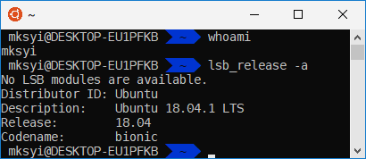

# MksYi's Dotfiles
## Demo


## Install On Your Linux
`git clone https://github.com/MksYi/dotfiles.git .dotfiles --depth 1 && cd .dotfiles && bash scripts/install.sh`

## For Windows Linux Shell  

### Font Install
[Download](https://raw.githubusercontent.com/MksYi/dotfiles/master/windows/DejaVu%20Sans%20Mono%20Bold%20for%20Powerline.ttf) Powerline Font and Install  

### Support to Windows Command-Line
[Download](https://raw.githubusercontent.com/MksYi/dotfiles/master/windows/for_Windows_font.reg) Windows Reg.

And then, cheange cmd Font.  

### Launch Zsh

Add the following lines to your `~/.bashrc`
```bash
if [ -t 1 ]; then
    exec zsh
fi
```
## Reference Config

- Inndy/[dotfiles](https://github.com/Inndy/dotfiles)
- iplaces/[astro-zsh-theme](https://github.com/iplaces/astro-zsh-theme)
